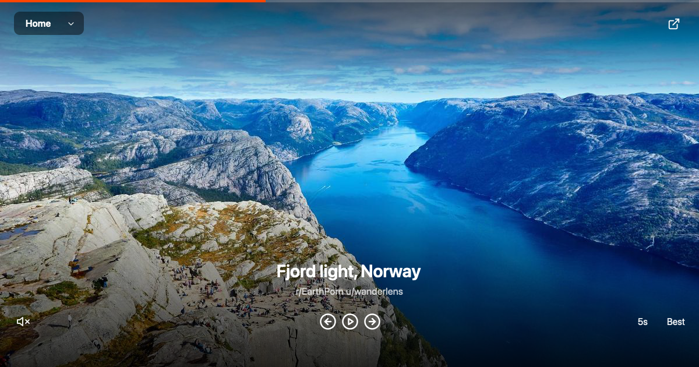
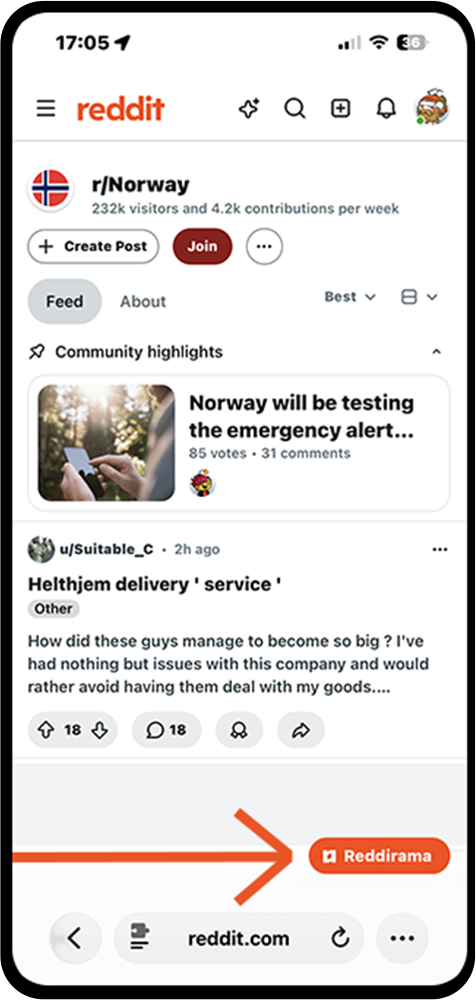
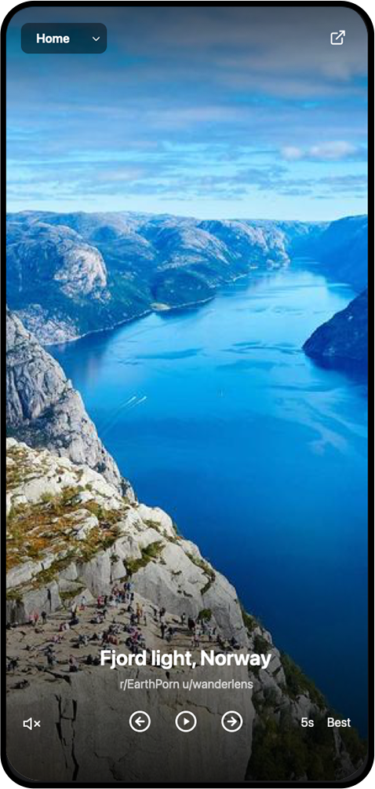

# Reddirama



Turn Reddit into a fullscreen, hands-free slideshow. Play any **subreddit** or **profile**, your
**Home** feed, or (logged in) your **saved** and **upvoted** posts and your **custom feeds**.
Sorting adapts to the source (saved, upvoted and profiles: newest/oldest/shuffle; Home: best/hot/new/top; subreddits and feeds: hot/new/top).
Adjustable speed, sound, and video scrubbing. No login needed to play any subreddit or profile; log in to also get your Home, saved, upvoted and custom feeds.

**Live viewer:** <https://zaaphod42.github.io/reddirama/>

## What it plays

Tap the **Reddirama** button on reddit.com. What plays depends on the page you're on, and you can
switch source anytime from the menu in the viewer:

- on a **subreddit** page (`r/...`): that subreddit
- on a **profile** page (`u/...`): that person's posts
- **logged in**, the menu also holds your **Home** feed, your **Saved**, **Upvoted** and **custom feeds**
- **logged out**, it works on public sources (**Popular**, plus the subreddit or profile you're on)

## How it works

A small **userscript** (or the browser extension) runs on reddit.com and reads the chosen listing
using your existing Reddit session, then opens the **viewer** (a static page on GitHub Pages) and
sends it the data via `postMessage`. Nothing is stored anywhere; there's no Reddit app to create and
no extra login. (Reddit's pages are locked down by a strict CSP, so the slideshow lives on a
separate origin, that's why there's a hosted viewer.)

## Install (once)

**Chrome, Edge, Brave (easiest):** get it in one click from the [Chrome Web Store](https://chromewebstore.google.com/detail/reddirama/mledcgjmckciblonmlbpbidjdckbapgl).

**Firefox:** get it in one click from [Firefox Add-ons](https://addons.mozilla.org/firefox/addon/reddirama/).

**Or install it as a userscript** (works everywhere, including **iPhone / iPad**). You need a userscript manager in your browser, then the script itself.

**iPhone / iPad (Safari):**
1. Install the free **Userscripts** app from the App Store.
2. *Settings → Safari → Extensions → Userscripts* → enable it and allow it on **reddit.com**.
3. In the Userscripts app, either create a new script and paste the contents of
   [`userscript/reddirama.user.js`](userscript/reddirama.user.js),
   or just save that `.user.js` file into your Userscripts folder. Tip: keep that folder on
   **iCloud Drive** so the same script follows you on all your devices.

**Mac / Windows / Linux:** install **Tampermonkey** (Chrome, Firefox, Edge) or **Userscripts** (Safari on Mac), then add the script from the link above.

**Android:** use **Firefox** with **Tampermonkey**, or **Kiwi Browser**, then add the script.

The browser extension (one click, no userscript manager) is on the [Chrome Web Store](https://chromewebstore.google.com/detail/reddirama/mledcgjmckciblonmlbpbidjdckbapgl) and [Firefox Add-ons](https://addons.mozilla.org/firefox/addon/reddirama/). Its source lives in [`extensions/chrome-firefox/`](extensions/chrome-firefox/), built from the same code, and there's also an experimental **Safari** build (an Xcode project) in [`extensions/safari/`](extensions/safari/). See [`extensions/README.md`](extensions/README.md) to load or build each.

## Use

1. Open **reddit.com** (logged in).
2. Tap the **▶ Reddirama** button (bottom-right).
3. The slideshow opens in a new tab, first images appear quickly, the rest stream in.

Opening Reddirama from a **subreddit** or **profile** page puts that source at the top of the menu and plays it first; Home, Saved, Upvoted and your feeds stay one tap away.

 

**Gestures:**
- **Tap** the left / right third: previous / next. **Tap** the center: show or hide the controls (they also auto-hide after a few seconds).
- **Gallery post** (several images): **tap** moves through the images; **swipe** left or right jumps to the next / previous post (skips the rest of the album).
- **Video**: **drag** horizontally anywhere to scrub (seek); **tap** to navigate.
- **Pinch** to zoom (native), on images and videos.
- **Keyboard**: `space` = play/pause, `←` / `→` = previous / next, `o` = order, `+` / `-` = speed, `m` = sound, `c` = show/hide controls.

## Notes

- Images, GIFs, galleries and videos are shown; text posts and comments are skipped.
- Video sound works in **Safari**.
- Your data goes only between you, Reddit and the viewer, nothing is stored or sent elsewhere.

## Privacy

Reddirama collects no data: it reads your chosen Reddit listing through your existing session and shows it in the viewer, entirely in your browser. Nothing is stored or sent to any server. See [PRIVACY.md](PRIVACY.md).

## Develop

The viewer (`docs/index.html`) **and** the userscript (`userscript/reddirama.user.js`)
are **generated** from `src/` (shared `media.js`, `order.js`, `slideshow-core.js`, `slideshow.css`):

```bash
node userscript/build.mjs   # regenerate both
node --test                 # run tests
```

Don't edit the generated files by hand, change `src/` and rebuild.

## Status

Tested on **iOS** (Safari + the Userscripts app) so far. Contributions, bug reports and ideas are very welcome.

## Credits

Icons by [Lucide](https://lucide.dev) (ISC). Styled with [Tailwind CSS](https://tailwindcss.com) (MIT); video playback uses [hls.js](https://github.com/video-dev/hls.js) (Apache-2.0). Both are loaded from their CDNs. Preview photo by Oleksii Topolianskyi on [Unsplash](https://unsplash.com) ([Unsplash License](https://unsplash.com/license)).

## License

MIT, see [LICENSE](LICENSE).
